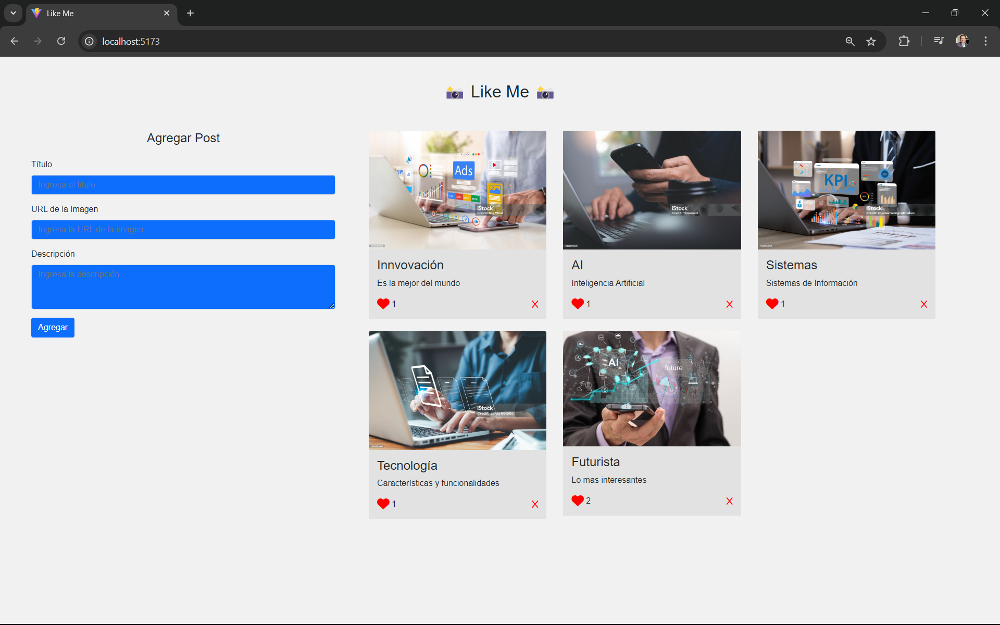

# Módulo 6 Acceso a BDD con Node y el paquete pg Parte 2 - Desafío 4 Like Me

## Presentación del Desafío

##  

## Descripción del PY ⌨️

La red social “Like Me” sigue desarrollando su plataforma y ahora necesita permitir la interacción de likes y la eliminación de posts.

## Requerimientos entregados:

1. Agregué una ruta PUT en una API REST y utilizarla para modificar registros en una tabla alojada en PostgreSQL.
2. Agregué una ruta DELETE en una API REST y utilizarla para eliminar registros en una tabla alojada en PostgreSQL.
3. Cree un archivo llamado server.js para manejar el servidor.
4. Capturé los posibles errores en una consulta SQL realizada con el paquete pg usando la sentencia try catch.

El servidor estará escuchando en http://localhost:3000. Las rutas disponibles serán:

- GET http://localhost:3000/posts: Para obtener todos los posts.
- POST http://localhost:3000/posts: Para agregar un nuevo post enviando un cuerpo en formato JSON con los campos titulo, url (para la imagen) y descripción.
- El archivo server.js contiene todo lo necesario para cumplir con los puntos del desafío.

Para ejecutar el PY:

1. Subir el servidor, ejecutando en el bash: node server.js
2. Abrir en el navegador la url: http://localhost:5173/

##  

## Tecnologías Usadas 🛠️

- **Backend:** Node.js, Express.js. 🧑‍💻
- **Frontend:** HTML, CSS, Axios. 📚
- **Almacenamiento:** Archivo JSON. 🫙

 

---

## Autor 👨‍💻

**Luis Fernando Sanchez F. - Desarrollador Fullstack G60⚡**

Sígueme en mis redes sociales: 
 
